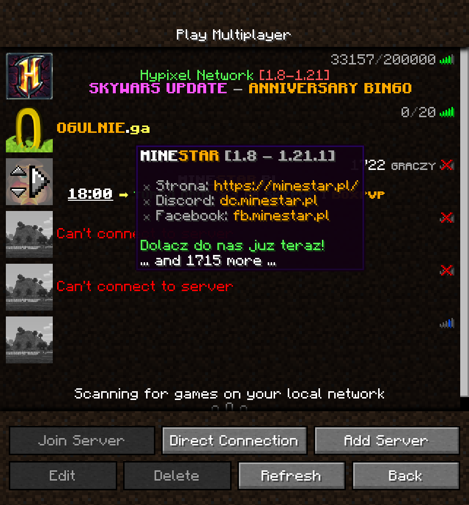
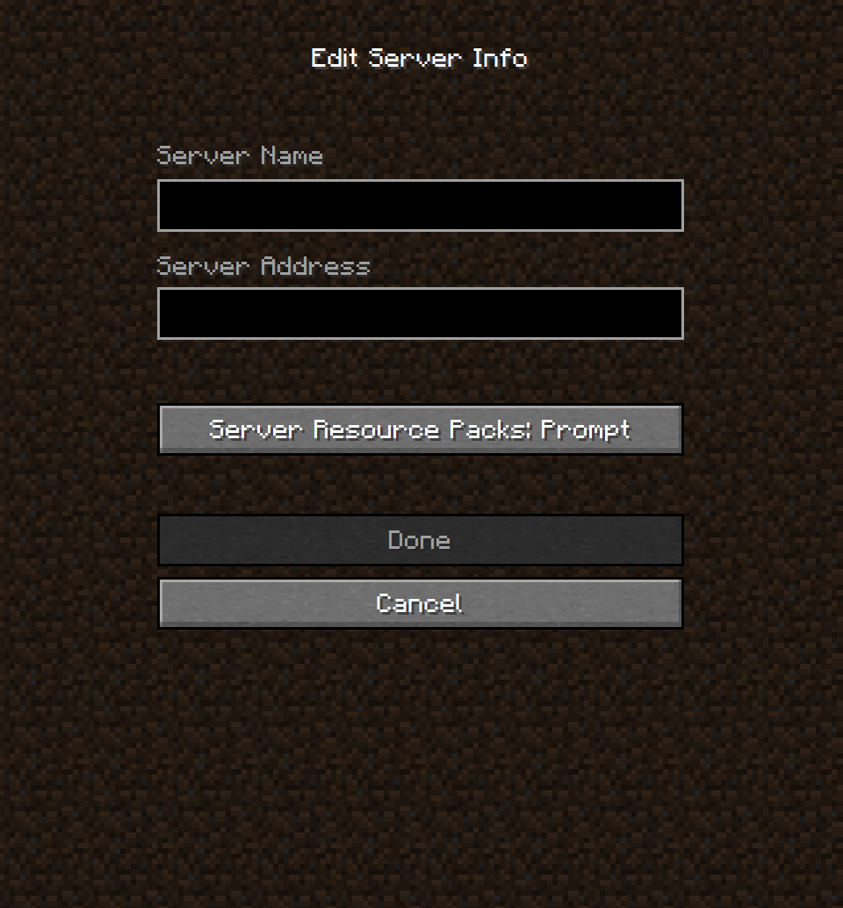
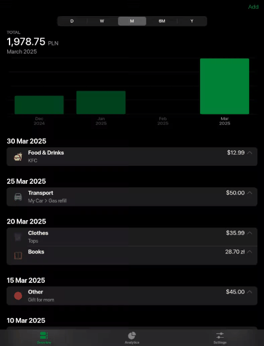
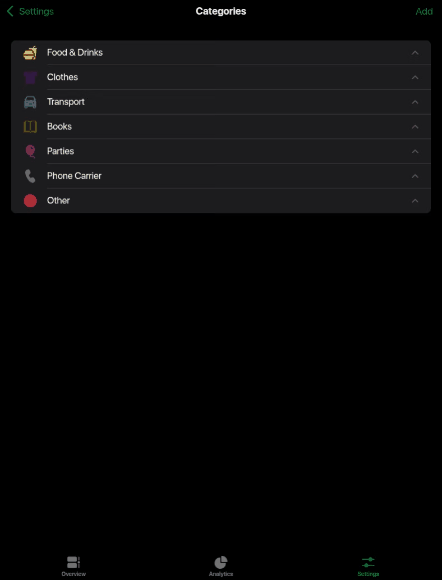

   
  

  <h3 align="center">Minecraft Multiplayer Screen</h3>

  

    Check server statuses without launching Minecraft!
     
    <a href="https://multiplayer.xmelonekmax.pl"><strong>Open the app »</strong></a>
  

## 🚀 Usage

<a href="https://multiplayer.xmelonekmax.pl">`multiplayer.xmelonekmax.pl`</a> - Show your server list

<a href="https://multiplayer.xmelonekmax.pl/hypixel.net">`multiplayer.xmelonekmax.pl/hypixel.net`</a> - Add the server & show your updated server list
  

## 🎥 Showcase

  
  
  
  

  

## 🛠️ Technical Details

- 1:1 replication of Minecraft 1.20.4 UI
- TypeScript
- React 19
- React Compiler
- React Router
- Vite PWA
- html-react-parser (https://www.npmjs.com/package/html-react-parser)
- Minecraft TOP - Status API (https://docs.mcsv.top/en/)
- minecraft-motd-parser (https://www.npmjs.com/package/@sfirew/minecraft-motd-parser)
    

## 🧪 Testing Tools

- Vitest
- React Testing Library
- Playwright
