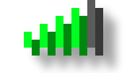

   
  

  <h3 align="center">FundLog</h3>

  

    A Next.js app for tracking expenses and visualizing stats. Fully offline, syncs to MongoDB, supports GitHub/Google OAuth, and faithfully mimics iOS using Tailwind and shadcn/ui
     
    <a href="https://fundlog.xmelonekmax.pl"><strong>Open the app »</strong></a>
  

## Usage
<a href="https://fundlog.xmelonekmax.pl">`multiplayer.xmelonekmax.pl`</a> - Show your server list

<a href="https://fundlog.xmelonekmax.pl/hypixel.net">`multiplayer.xmelonekmax.pl/hypixel.net`</a> - Add the server & show your updated server list

## Technical Details
* Next.js
* TypeScript
* React Compiler
* Serwist
* Arctic
* Mongoose
* MongoDB
* Dexie.js
* Tailwind
* shadcn/ui
